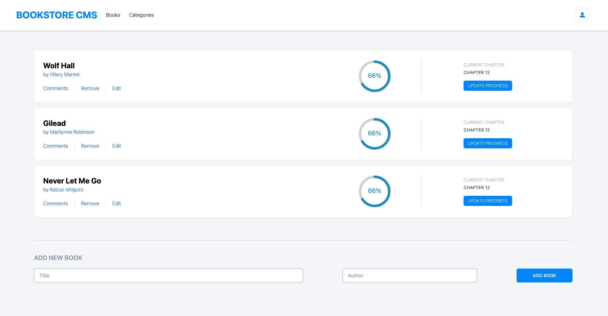

# Describtion

My BookStore .

## Installation

- Clone the repository , use  `https://github.com/SamanAtashi/BookStore-redux.git` 
- open terminal and change Directory, use `cd BookStore-redux`
- Install all Dependencies, use `npm install` or `npm i`

## Usage

### Development server
- to run the Webapp you need to use `npm run start`

You can now view the development server at `localhost:3000`.

## Built With

- React.js
- Redux
- bookstore API
- redux-thunk middleware

## Author

👤 **Saman Atashi**

- Twitter: [@AtashiSaman](https://twitter.com/AtashiSaman)
- GitHub: [@SamanAtashi](https://github.com/SamanAtashi)
- LinkedIn: [@saman-atashi](https://www.linkedin.com/in/saman-atashi/)

## 🤝 Contributing

Contributions, issues, and feature requests are welcome!

## Show your support

Give a ⭐️ if you like this project!

## Inspiration
Microverse
